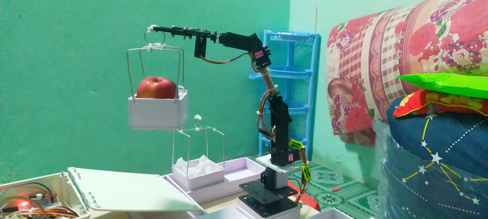
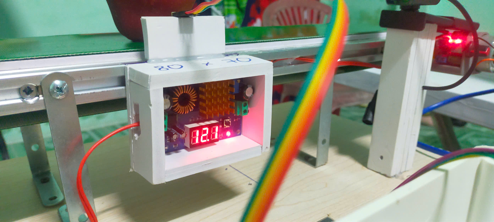
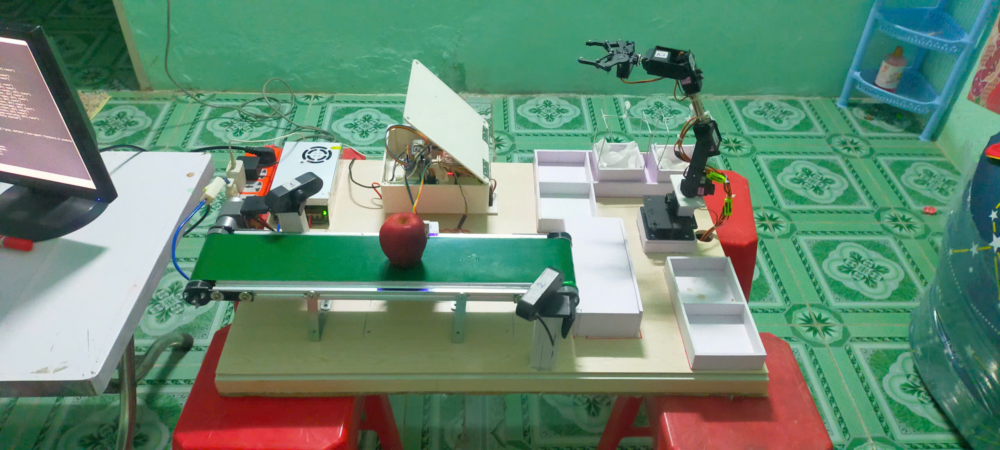
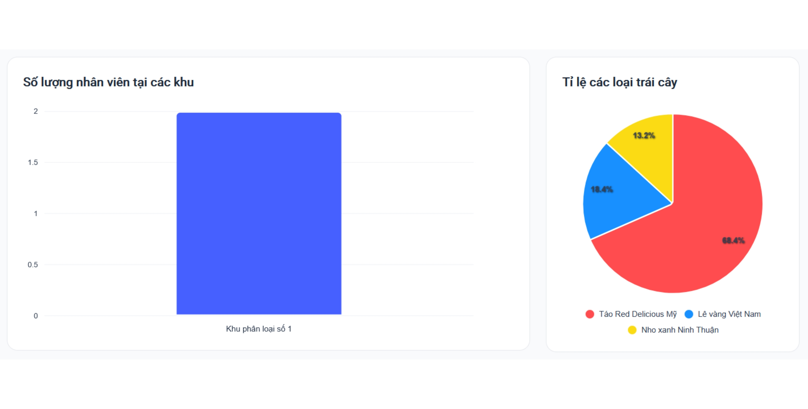
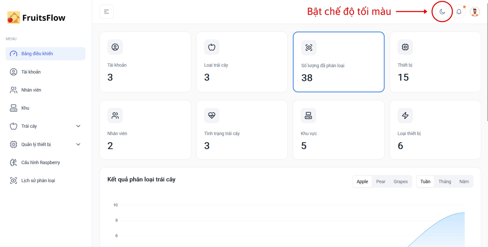
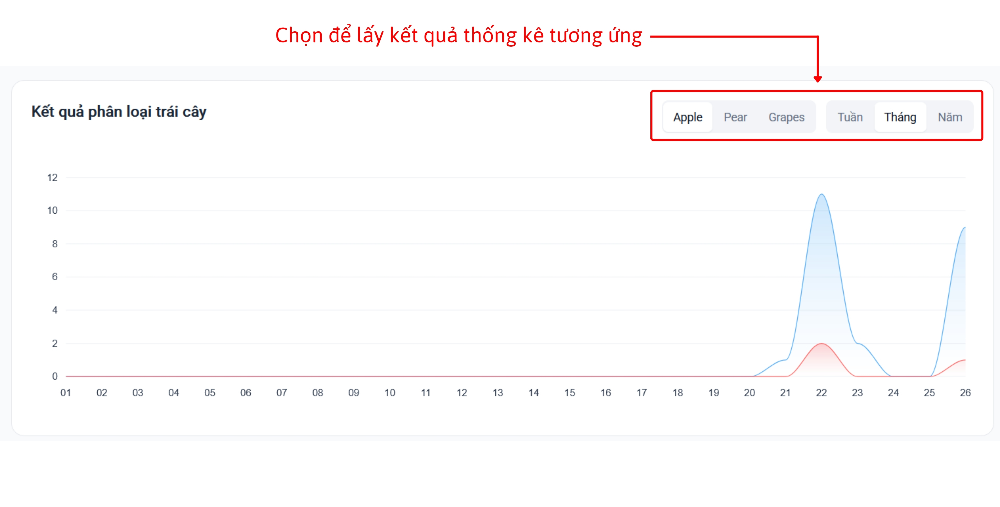
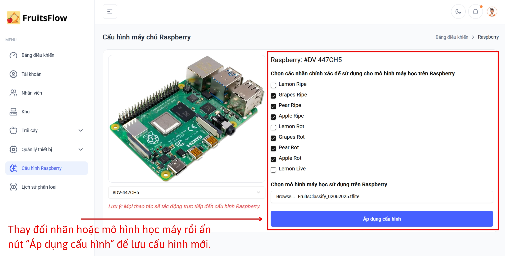
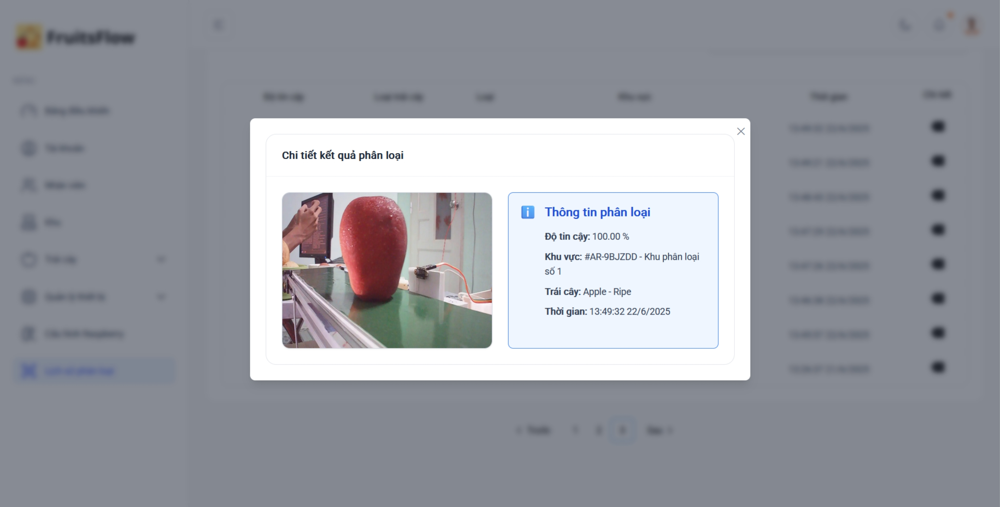

## FruitsFlow - Hệ thống phân loại trái cây tự động ứng dụng học máy và thị giác máy tính
<b><i>Luận văn tốt nghiệp</i></b>
- <b>Người thực hiện: </b> Đặng Nguyễn Tiền Hậu
- <b>Thời gian: </b>01/03/2025 - 03/07/2025
-----------------------
### Tổng quan về dự án
- Dự án là một đề tài luận văn tốt nghiệp hướng tới việc kết hợp các kiến thức về lĩnh vực:
    + Học máy (Machine Learning)
    + IoT (Internet of Things)
    + Website: NextJS & NestJS
    + Thị giác máy tính (Computer Vision)
để tạo ra một hệ thống phân loại trái cây tự động.
- Dự án ngoài vai trò là một đề tài nghiên cứu thì tôi mong muốn nó mang được tiềm năng đưa ra thực tiễn khi được đầu tư, phát triển một cách đầy đủ và quy mô hơn. Triển khai vào các nhà máy, xí nghiệp phân phối để hỗ trợ, đẩy nhanh quy trình phân loại mà không phụ thuộc vào con người.

<h4>Một số hình ảnh của dự án</h4>
<h5>Hệ thống IoT</h5>

  
  
  

<h5>Giao diện Website</h5>

  
  
  

  
  

-----------------------
### Các tính năng chính
1. Đăng nhập và xác thực với JWT Refresh & Access Token.
2. Quản lý các đối tượng cơ bản trong công xưởng:
    - Quản lý (CRUD) tài khoản truy cập.
    - Quản lý (CRUD) thông tin nhân viên làm việc trong công xưởng.
    - Quản lý (CRUD) khu vực phân loại.
    - Quản lý (CRUD) thiết bị, loại thiết bị và trạng thái thiết bị.
    - Quản lý (CRUD) loại trái cây, tình trạng trái cây.
3. Báo cáo, thống kê các thông tin:
    - Kết quả phân loại theo từng loại trái, từng khung thời gian (tuần/tháng/năm).
    - Tỉ lệ của từng loại trái cây được lưu trữ trong hệ thống.
    - Số lượng nhân viên làm việc tại từng khu vực phân loại.
    (Dữ liệu báo cáo liên quan đến trái cây và tỉ lệ phân loại được cập nhật tự động trên Dashboard nếu có kết quả phân loại mới)
4. Xem xét lịch sử phân loại:
    - Xem danh sách kết quả phân loại trên hệ thống.
    - Xem chi tiết một kết quả phân loại:
        + Hình ảnh
        + Kết quả (nhãn)
        + Độ tin cậy
        + Được phân loại ở khu vực nào?
        + Thời gian phân loại
    (Kết quả được cập nhật tự động vào danh sách nếu có kết quả phân loại mới)
5. Cấu hình máy tính Raspberry từ xa (Chức năng nâng cao):
    Mỗi khu vực phân loại đều có một máy tính Raspberry Pi đảm nhận trách nhiệm sử dụng mô hình học máy để nhận diện và gửi kết quả đến các thành phần (Website & IoT) để phân loại và ghi nhận kết quả vào hệ thống.
    Chúng ta chọn Raspberry cần cấu hình và dễ dàng thay đổi được các thông tin như:
    + Nhãn phân loại: Được khởi tạo trực tiếp từ dữ liệu trái cây và tình trạng trong hệ thống (VD: Apple Ripe, Apple Rot,...)
    + Mô hình máy học: Import file mô hình (MobileNetV2 với định dạng .tflite) vào hệ thống.

Website sẽ gửi yêu cầu về Raspberry tương ứng thông qua SocketIO để yêu cầu nó tải mô hình và cấu hình nhãn về rồi tiếp tục dùng nó để phân loại.

-----------------------------------------------
### Kết quả
<b>Ưu diểm: </b>
- Hệ thống chạy demo ổn định khi được trình bày trước ban giám khảo.
- Phản biện tốt các câu hỏi của phản biện 1, 2 và các giảng viên khác.
- Hội đồng đánh giá trên thang điểm 10: 9.1 điểm.

<b>Hạn chế: </b>
- Hệ thống chưa phân loại hoàn hảo 100%, vẫn còn nhiều sai lệch.
- Cảm biến khoảng cách VL53L0X bị nhiễu, dễ tạo kết quả nhầm.
- Cơ chế cánh tay chưa nhanh chóng, tối ưu. Nên sử dụng máng hoặc cần gạt để đẩy nhanh quy trình phân loại trong thực tế.

-----------------------------------------------
### Liên Hệ
Nếu bạn có bất kỳ câu hỏi nào hoặc muốn đóng góp cho dự án, hãy liên hệ với tôi qua:

- Email: [tienhau.it@gmail.com](mailto:tienhau.it@gmail.com)
- GitHub: [Thomas Dang](https://github.com/HauDNT)
- LinkedIn: [Hau Dang](https://www.linkedin.com/in/haudnt/)